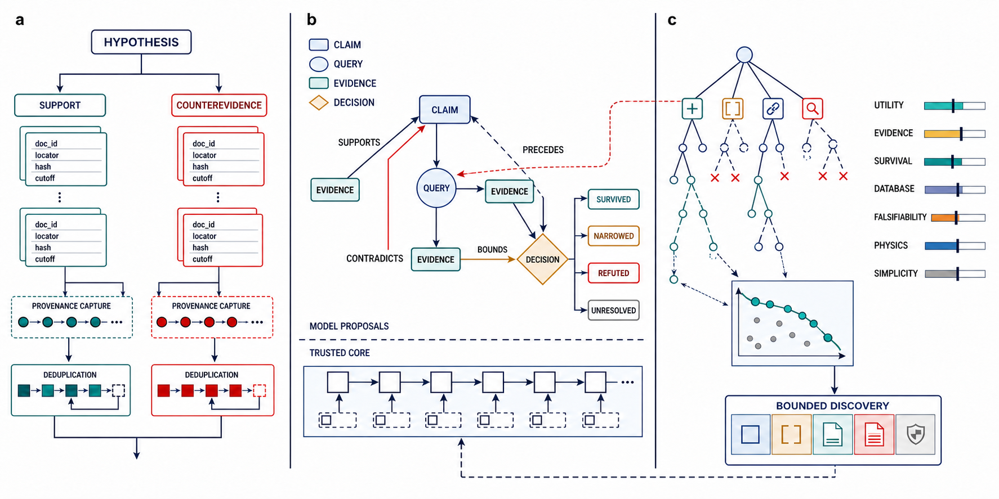
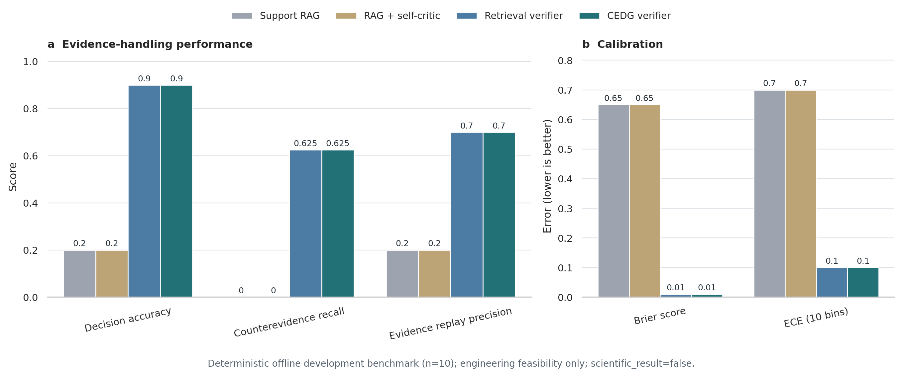

# VeriMat

VeriMat is an auditable research-agent core for evidence-grounded materials discovery.
Language models may propose hypotheses and search actions, while deterministic gates,
replayable evidence records, and counterevidence-aware search determine which bounded
claims survive.

## Core components



- `src/evidence`: hash-chained event ledger and Claim–Evidence Decision Graph projection;
- `src/discovery`: counterevidence-aware Pareto-MCTS and external evidence gates;
- `src/orchestration`: durable jobs, leases, checkpoints, budgets, and content-addressed artifacts;
- `src/learning`: delayed external credit and auditable policy updates;
- `src/evaluation`: blinded evaluation, calibration, evidence replay, and statistical comparisons;
- `src/operations` and `src/service`: migrations, backup, retention, rate limits, tracing, and control APIs.

## Quick start

VeriMat requires Python 3.11 or newer. The test suite and included example run offline.

```bash
python -m venv .venv
source .venv/bin/activate
python -m pip install -r requirements-dev.lock
PYTEST_DISABLE_PLUGIN_AUTOLOAD=1 python -m pytest -q
python examples/pareto_mcts_demo.py
```

The bundled development benchmark validates software plumbing only. It is not evidence
of a new materials discovery or open-world scientific performance.

## Reproducible experiment

The complete offline experiment runner, method registry, per-task predictions, scored outputs,
aggregate summaries, statistical comparison, and figure source are included in `experiments/`
and `results/`. See [`experiments/README.md`](experiments/README.md) for the exact command.



## License

VeriMat is released under the [MIT License](LICENSE).
